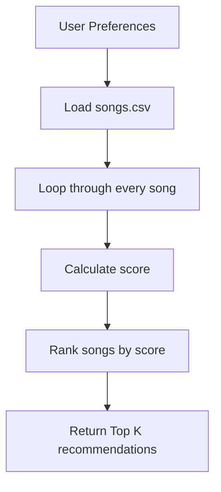

# 🎵 Music Recommender Simulation

## Project Summary

In this project you will build and explain a small music recommender system.

Your goal is to:

- Represent songs and a user "taste profile" as data
- Design a scoring rule that turns that data into recommendations
- Evaluate what your system gets right and wrong
- Reflect on how this mirrors real world AI recommenders

Replace this paragraph with your own summary of what your version does.

---

## How The System Works

### How real recommendation systems work

Apps like Spotify, YouTube Music, and TikTok are always trying to guess what
you will enjoy next. They mostly do this in two ways:

- **Collaborative filtering** — "people who liked what you like also liked
  this." The app looks at millions of other listeners and finds people with
  similar taste, then recommends songs those similar people enjoyed. It never
  needs to understand the music itself; it only needs your behavior (likes,
  skips, replays, listening history, saved playlists) compared to everyone
  else's.
- **Content-based filtering** — "here is another song that *sounds like* what
  you already enjoy." Instead of comparing you to other people, the app
  compares songs to each other using their features (genre, mood, energy,
  tempo, and so on) and recommends the ones that most closely match your
  taste.

The big real apps blend both, plus signals like time of day, device, and
whether you skipped a track in the first few seconds.

### What this project does

**This project uses content-based filtering.** We do not have data about other
users, so we cannot compare listeners. Instead we describe each song with a
handful of features, describe the user's taste with a small profile, and score
every song by how well it matches that profile.

### What each `Song` stores

Each song is loaded from `data/songs.csv` and keeps these features:

- `genre` and `mood` — **categorical** labels (e.g. `pop`, `lofi`, `chill`,
  `intense`)
- `energy`, `tempo_bpm`, `valence`, `danceability`, `acousticness` —
  **numerical** audio features
- `id`, `title`, `artist` — identifying information used for display, not for
  scoring

### What the `UserProfile` stores

The user's taste is kept as a small profile:

- `favorite_genre` — the genre they most want to hear
- `favorite_mood` — the mood they are in
- `target_energy` — the energy level they are aiming for (0.0 = calm,
  1.0 = high energy)
- `likes_acoustic` — whether they prefer acoustic-sounding songs

### How weighted scoring works

The `Recommender` gives every song a single **score** that says how well it
matches the user. Each feature contributes points, and more important features
are given a bigger **weight**:

- **Categorical match (genre, mood):** award full points when the song's label
  exactly matches the user's preference, and no points when it does not.
- **Numerical closeness (energy):** reward songs whose value is *close* to the
  user's target — not simply the largest value. A song scores highest when its
  energy is near `target_energy` and loses points the farther away it is.
- **Boolean preference (acoustic):** if the user likes acoustic music, give
  more points to songs with higher `acousticness` (and the reverse if they do
  not).

Although each `Song` object stores additional attributes like `tempo_bpm`,
`valence`, and `danceability`, the first version of the recommender will only
use `genre`, `mood`, `energy`, and `acousticness` for scoring to keep the
implementation simple and beginner-friendly.

Roughly:

```
score = (w_genre  * genre_match)
      + (w_mood   * mood_match)
      + (w_energy * energy_closeness)
      + (w_acoustic * acoustic_fit)
```

A reasonable starting point is to weight genre and mood most heavily (they are
the strongest taste signals), with energy and acoustic fit contributing a bit
less.

### How ranking works

There are two separate steps:

1. **Scoring one song** answers "how good is *this* song for this user?" and
   returns a single number.
2. **Ranking all songs** scores *every* song in the catalog, sorts them from
   highest to lowest, and returns the top `k` as the recommendations.

So scoring is done once per song, and ranking is what turns all of those
individual scores into an ordered "Top 5" list.

### The finalized algorithm recipe

1. Read the user's preferences (the `UserProfile`).
2. Load every song from `data/songs.csv`.
3. Loop through the songs one at a time and give each a score.
4. For each song, add up four weighted parts: genre match, mood match, energy
   closeness, and acoustic fit.
5. Sort all the songs from the highest score to the lowest.
6. Return the top `k` songs as the recommendations.

### The chosen UserProfile

For this simulation we use one simple, beginner-friendly profile:

```python
user_prefs = {
    "favorite_genre": "lofi",
    "favorite_mood": "chill",
    "target_energy": 0.35,
    "likes_acoustic": True,
}
```

This describes someone who wants calm, acoustic-leaning study music.

### The scoring weights

| Part | Weight | How it is scored |
|------|:------:|------------------|
| Genre match | **2.0** | `1` if the song's genre equals `favorite_genre`, else `0` |
| Mood match | **1.5** | `1` if the song's mood equals `favorite_mood`, else `0` |
| Energy closeness | **1.0** | `1 - abs(song.energy - target_energy)` (closer is better) |
| Acoustic fit | **1.0** | `song.acousticness` if `likes_acoustic`, else `1 - song.acousticness` |

```
score = (2.0 * genre_match)
      + (1.5 * mood_match)
      + (1.0 * energy_closeness)
      + (1.0 * acoustic_fit)
```

**Why these weights are reasonable:** genre is the strongest signal of what a
listener wants, so it earns the most points, with mood close behind. Energy and
acoustic fit are "fine-tuning" signals, so they are worth a bit less. Energy
uses *closeness* (`1 - abs(...)`) instead of the raw value, so a song scores
highest when its energy is near the user's target — a calm listener is not
handed the loudest track just because its number is bigger.

### Data flow



### Expected bias

Because genre carries the heaviest weight, the system tends to over-prioritize
genre: a song in the user's favorite genre can beat a song that fits their mood,
energy, and acoustic taste far better but happens to be labeled a different
genre. This means genuinely good matches can be pushed down the list simply for
having the "wrong" genre tag, and the recommendations may feel repetitive
instead of surfacing variety.

---

## Getting Started

### Setup

1. Create a virtual environment (optional but recommended):

   ```bash
   python -m venv .venv
   source .venv/bin/activate      # Mac or Linux
   .venv\Scripts\activate         # Windows

2. Install dependencies

```bash
pip install -r requirements.txt
```

3. Run the app:

```bash
python -m src.main
```

### Running Tests

Run the starter tests with:

```bash
pytest
```

You can add more tests in `tests/test_recommender.py`.

---

## Sample Recommendation Output

Running `python src/main.py` with the profile
`favorite_genre="lofi", favorite_mood="chill", target_energy=0.35, likes_acoustic=True`
produces:

```
Top recommendations:

-------------------------------------
1. Library Rain
Artist: Paper Lanterns
Score: 5.36

Reasons:
- Genre match (+2.0)
- Mood match (+1.5)
- Energy close (+1.00)
- Acoustic fit (+0.86)

-------------------------------------
2. Midnight Coding
Artist: LoRoom
Score: 5.14

Reasons:
- Genre match (+2.0)
- Mood match (+1.5)
- Energy close (+0.93)
- Acoustic fit (+0.71)

-------------------------------------
3. Focus Flow
Artist: LoRoom
Score: 3.73

Reasons:
- Genre match (+2.0)
- Energy close (+0.95)
- Acoustic fit (+0.78)

-------------------------------------
4. Spacewalk Thoughts
Artist: Orbit Bloom
Score: 3.35

Reasons:
- Mood match (+1.5)
- Energy close (+0.93)
- Acoustic fit (+0.92)

-------------------------------------
5. Coffee Shop Stories
Artist: Slow Stereo
Score: 1.87

Reasons:
- Energy close (+0.98)
- Acoustic fit (+0.89)

-------------------------------------
```

**Screenshot or video** *(optional)*: <!-- Insert a screenshot or demo video link here -->

---

## Experiments You Tried

Use this section to document the experiments you ran. For example:

- What happened when you changed the weight on genre from 2.0 to 0.5
- What happened when you added tempo or valence to the score
- How did your system behave for different types of users

---

## Limitations and Risks

Summarize some limitations of your recommender.

Examples:

- It only works on a tiny catalog
- It does not understand lyrics or language
- It might over favor one genre or mood

You will go deeper on this in your model card.

---

## Reflection

Read and complete `model_card.md`:

[**Model Card**](model_card.md)

Write 1 to 2 paragraphs here about what you learned:

- about how recommenders turn data into predictions
- about where bias or unfairness could show up in systems like this


